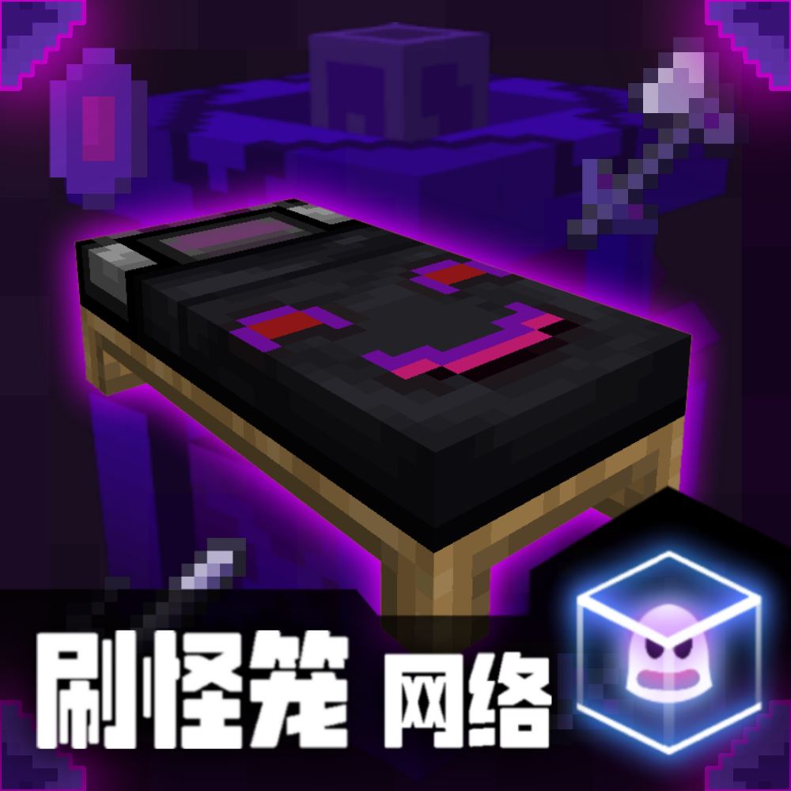

 **注意，该模组代码仅可用来预览，你无法装载在Minecraft国际版中。如果你想游玩该模组，请前往我的世界中国版基岩端中搜索开发者账号“刷怪笼工作室”，选择对应的模组购买并下载使用。如果你也是Minecraft爱好者，不妨点个Star支持下，谢谢！** 

**Note that this module code is only available for preview and cannot be loaded into Minecraft International Edition. If you want to play this mod, please search for the developer account "Brushing Monster Cage Studio" in Minecraft China version of the bedrock platform, select the corresponding module to purchase and download for use. If you are also an MC enthusiast, why not click on Star support? Thank you!**

你还在为生存不够有趣而烦恼吗？快来试试这个模组吧！

加载该模组后你可以获得:

★一个可以进入梦境的床，产生随机事件

★三把比合金武器还强悍的梦魇武器

★一块强悍的梦魇石，可在晚上睡觉时直达末地

★一个会发光的梦魇方块

当你每次想睡觉时，此模组会发挥床的最大用处。当你每晚睡在特定的梦魇之床后，你会产生N种不同事件，例如你会获得钻石级甚至梦魇级的武器，也有可能梦见梦魇宝箱怪，击败它能直接获得梦魇武器。梦魇武器除了数值高以外，更提升了它的附魔能力，使其更容易附魔到高等级的属性。

通过睡觉/击败末影人/击败梦魇宝箱怪可以获得梦魇碎片，使用梦魇碎片可以合成梦魇石，晚上手持梦魇石在梦魇之床上睡觉可直接进入末地，免除找末地传送门的烦恼。

当然，这一切肯定也有惩罚，如果你在睡觉的过程主动起床，那你就会遭到梦魇的惩罚。

